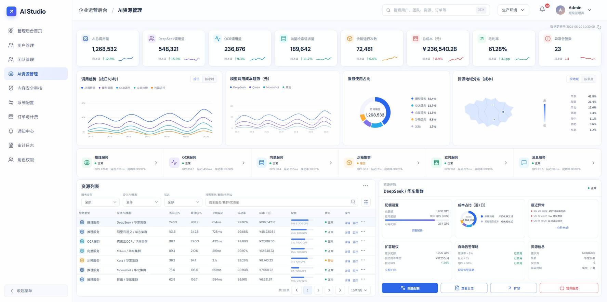
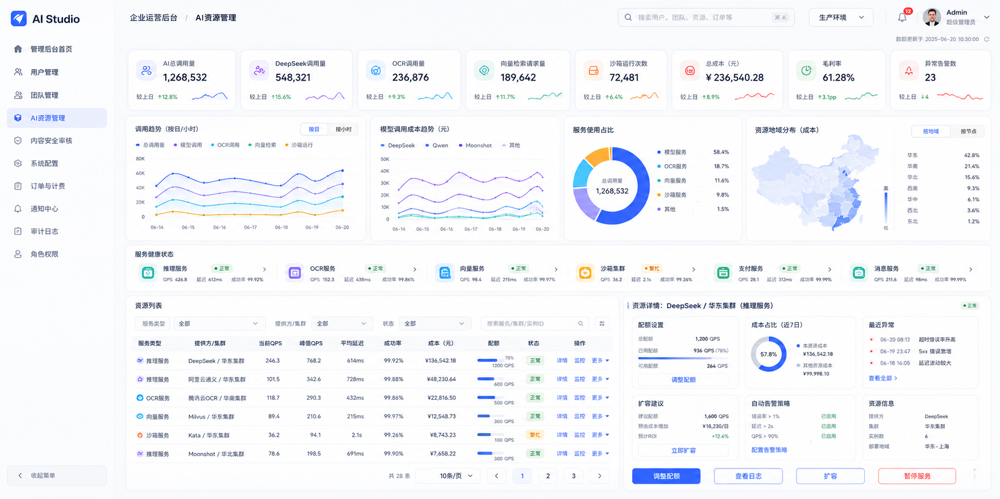

# preparing-ui-replica-handoffs

我自己制作的 Codex Skill：把设计稿图片、UI 设计语言图、组件板、品牌板、状态图和动效参考，整理成可供下游 UI Agent 使用的中英双语 UI 复刻交付包。

`preparing-ui-replica-handoffs` 面向桌面端 Web 和单一软件系统，重点解决设计稿复刻中的信息遗漏与无依据猜测问题。它会保留原始设计稿不动，并生成页面、状态、变体、导航、布局、组件、视觉 Token、动效、语义状态、微视觉和 Diff 验收合同。

## 能做什么

- 识别并区分页面图、UI 设计语言图、组件图、品牌图、状态/动效图和装饰背景。
- 支持多张设计语言权威图，记录版本、主题、模块、作用域、互补规则和冲突。
- 先对齐并冻结规范导航，再进行逐页 UI 复刻。
- 支持桌面端 Web 混合布局：固定 Shell、弹性工作区、原生尺寸基线、页面/模块/混合滚动和必要的宽度扩展。
- 记录按钮、搜索、多选、表格、AI 对话、文件、工作流、Diff、日志等组件规范。
- 记录优先级、流程状态、证据等级、审批、风险、同步和 AI 状态的颜色与几何语义。
- 记录 Hover、Focus、Pressed、Selected、展开、加载和 Reduced Motion 动效。
- 输出中英文文档、机器合同、逐页实施合同和 Reference/Current/Overlay/Diff 验收目标。

## 输出内容

运行 Skill 后会生成：

- `docs/zh/`、`docs/en/`：中英双语设计稿目录、UI 设计语言、实施说明、组件规范和逐页合同。
- `assets/designs/`：英文编号的设计稿副本，使用相对路径和 SHA-256 追溯。
- `contracts/`：页面、设计语言、Token、组件、导航、动效、语义状态、微视觉、布局、实施计划和 Diff 等机器可读合同。
- `reports/`：联系表和验证报告。
- `tools/validate-command.txt`：标准验证命令。

## 使用方式

在 Codex 中安装插件后，将设计稿图片目录交给：

```text
$preparing-ui-replica-handoffs
```

建议先让 Skill 生成交付包，再让 UI Agent 按页面编号逐页实施到同一个 Router、同一个开发服务器和同一个软件系统中。

## 复刻示例

下面的两张图是 Skill 完善前的早期示例，用于展示“设计稿参考 → 实际 UI 复刻”的效果。当前版本已经补充了多设计语言、逐页微视觉、语义状态、导航冻结、动效、证据图谱和 Diff 合同；使用 SoI 模型时，预计可以获得更好的复刻效果。

### 设计稿参考图



### 实际 UI 复刻图



## 目录说明

| 目录 | 作用 |
|---|---|
| `plugin/preparing-ui-replica-handoffs/` | Codex 插件目录，包含插件清单和嵌入式 Skill。 |
| `skill/preparing-ui-replica-handoffs/` | Skill 源码目录。 |
| `examples/` | 复刻示例图片。 |
| `tests/` | 合同、生成器、验证器和插件结构测试。 |

## 当前状态

当前版本为 `1.0.0+codex.20260806040539`。完整测试套件为 192/192 通过。
